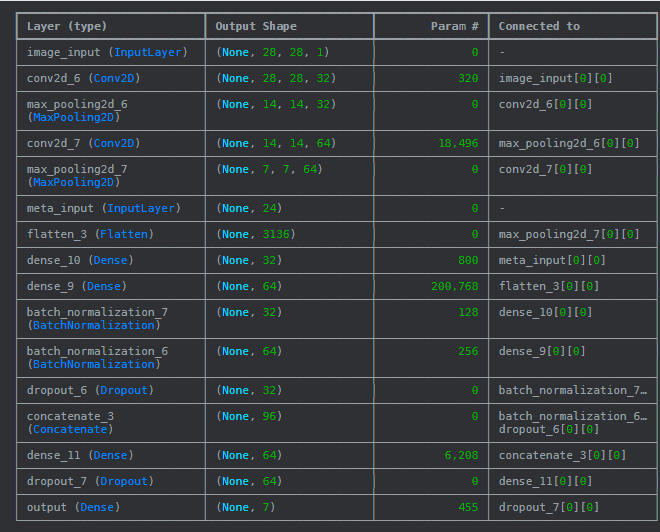
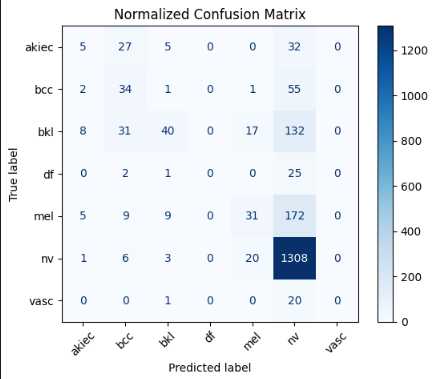
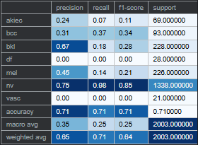

# 🩺 Skin Lesion Classification

🧠 Multi-input CNN using image data + patient metadata to classify 7 skin lesion types.

## 📁 Dataset
- HAM10000 + 4 image formats (8x8 & 28x28, RGB & grayscale)
- Metadata: sex, age, lesion location, dx_type

## 🧪 Approach
- Trained 4 CNN models across different image sizes and color channels
- Included patient metadata as a second input branch
- Evaluated performance using precision, recall, F1-score, and confusion matrix

🧪 Summary of Neuronal Network for 28*28 RGB

## 📊 Results
| Image Format | Accuracy | Macro F1 | Notable Insights |
|--------------|----------|----------|------------------|
| 8x8 RGB      | ~0.75    | Lower    | Weak class separation |
| 8x8 Gray     | ↑ recall | Better minority class perf |
| 28x28 Gray   | ↑ structure | Lower color sensitivity |
| 28x28 RGB    | ✅ Best   | Solid across all metrics  |

📷 Key Visuals

- Confusion Matrix 28*28 RGB Model + metrics

## 🔁 Next Steps
See final notebook cell — includes image augmentation & transfer learning.

📂 Notebook
👉 [View on Kaggle](https://www.kaggle.com/code/victoriacabrerag/hmnist-full-eda-cnn?scriptVersionId=240597984)

Built with ❤️ by Victoria Cabrera
